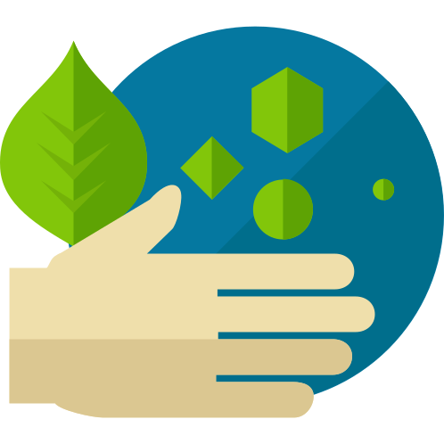

<h1 align="center">
    
</h1>

<h4 align="center"> 
	Solução digital proposta na Next Level Week da rocketseat que facilita a coleta seletiva
</h4>

  

  
	
  

  

  
   

  <a href="#Introdução">Introdução</a>&nbsp;&nbsp;&nbsp;|&nbsp;&nbsp;&nbsp;
  <a href="#Tecnologias">Tecnologias</a>&nbsp;&nbsp;&nbsp;|&nbsp;&nbsp;&nbsp;
  <a href="#Arquitetura">Arquitetura</a>&nbsp;&nbsp;&nbsp;|&nbsp;&nbsp;&nbsp;
  <a href="#Fontes">Fontes</a>&nbsp;&nbsp;&nbsp;|&nbsp;&nbsp;&nbsp;

## Introdução
Solução full stack do app proposto na Semana Next Level
	
## Tecnologias
Project is created with:
* Node: 13.6.0
* React: 16.13.1
* Typescript: 3.9.3
* express: 4.17.1
* knex: 0.21.1
* sqlite3: 4.2.0

## Arquitetura
Fluxo de dados da aplicação:

## Fontes

* 
Ícone do início do repositório feito por <a href="https://www.flaticon.com/br/autores/roundicons" title="Roundicons">Roundicons</a> from <a href="https://www.flaticon.com/br/" title="Flaticon">www.flaticon.com</a>

* Uma implementação da 1º Next Level Week, by -> 🚀 https://rocketseat.com.br/ 🚀
